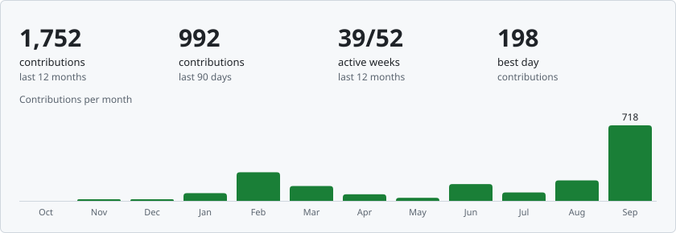

  <samp>
    <a href="https://nathan.directory">portfolio</a> ·
    <a href="https://www.linkedin.com/in/n-pizzetta/">linkedin</a> ·
    <a href="https://calendia.ai">calendia.ai</a>
  </samp>

  <picture>
    <source media="(prefers-color-scheme: dark)" srcset="assets/kpis-dark.svg">
    
  </picture>

